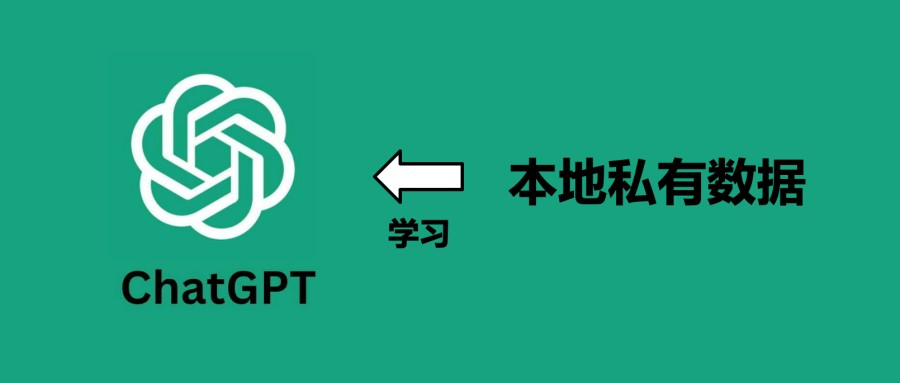
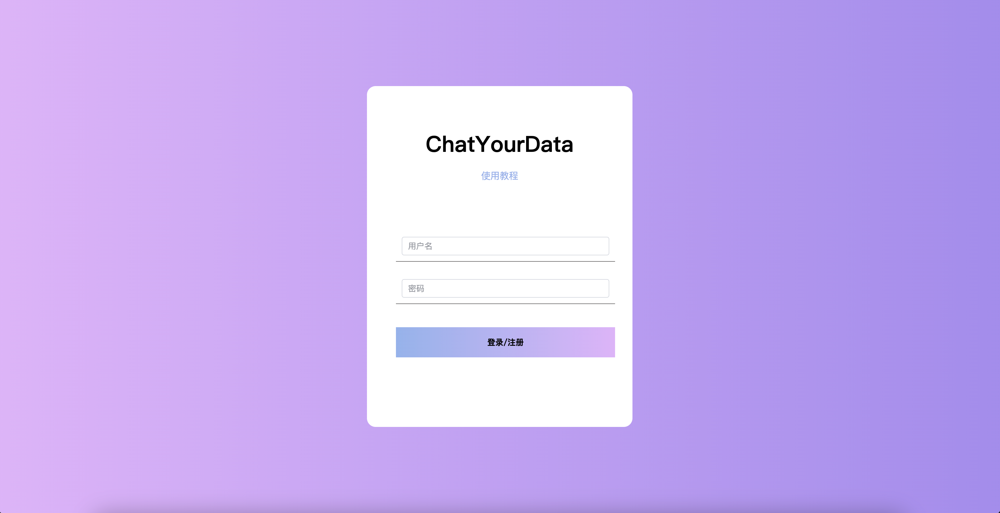

# ChatYourData

ChatYourData ([github](https://github.com/hbchen121/ChatYourData)) 是一个基于ChatGPT等大模型技术的数据处理网站，通过上传用户私有数据、建立索引，用户可基于私有数据与ChatGPT等大模型进行对话，使大模型具有私有数据知识先验的前提下对用户的问题进行解答。具体的原理可参考：
- [如何让 ChatGPT(LLMs) 学习更多的私有数据知识？（一）](https://mp.weixin.qq.com/s/rpQMZmAeFzNFEYMBQgp_Ng)
- [如何让 ChatGPT(LLMs) 学习更多的私有数据知识？（二）](https://mp.weixin.qq.com/s/2iu8x5RlcWTLu9yCR4ChRg)

## ChatYourData 特点

- 网页部署地址：[link](http://101.42.32.28:5173/)（域名待续中）
- 通过 ChatYourData 可以使 ChatGPT 学习到用户私有知识；
- ChatYourData 需要用户使用自己的 OPEN API KEY，在无须魔法的情况下，也能与 ChatGPT 对话；

## 登录
- 输入用户名和密码即可自动注册登录，用户名和密码无限制，主要是为了保护个人的配置和文件；

## 用法
1. 登录完成后首先需要设置自己的 OPENAI API KEY，否则无法进行搜索，API KEY 获取可参考教程。设置 API KEY 后可以刷新一下页面，就能看到自己的 API KEY显示出来；
2. 将需要搜索（Chat）的数据（文件或链接）进行上传/添加：
   - 文件目前支持 .pdf, .epub, .md, .txt 类型文件
   - 链接对目标网站有要求，有些网站不能正常获取（比如github，csdn等）
3. 添加后，会出现一个文件项，同时index为 doing 状态，可以刷新下查看 index 状态变化。当状态为done时即可基于索引与数据内容进行交流。

## 构建

构建自己的 ChatYourData 服务见[安装教程](./docs/install.md)，你需要： 
- 自己的代理节点（不然无法访问OPENAI API）

基于本项目进行二次开发，你需要：
- 前端：Vue + JavaScript + Html
- 后端：Python + SQL + AI（可选，调接口就不需要，优化索引逻辑等可能需要，非必须）

## 合作

- 本项目的前端、后端交互等主要靠 ChatGPT 和 Claude 辅助编程来debug，我是不咋会前端...有相关AI辅助编程需要的朋友也欢迎交流..
- 欢迎有对这个项目感兴趣的志同道合的朋友交流，目前网站还有许多需要优化的地方，期待大家批评交流~

## 关于我
另外，介绍下自己，我是卷了又没卷，薛定谔的卷的AI算法工程师「陈城南」~ 
担任某大厂的算法工程师，带来最新的前沿AI知识和工具，欢迎大家交流~，后续我还会分享更多 AI 有趣工具和实用玩法，包括 ChatGPT、AI绘图等。
- 公众号「陈城南」
- 加V「cchengnan113」备注 AI交流群 进行交流
- 知乎账号「[陈城南](https://www.zhihu.com/people/cchengnan113)」