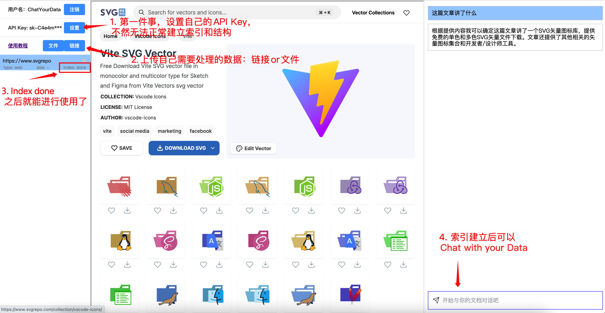

# ChatYourData

一个使用 `openai` 与文档对话的例子, 目前支持的文档类型 `.pdf`, `.epub`, `.md`, `.txt`, `.docx`, `web`



## 启动后端[docker.md](docs%2Fdocker.md)

```shell
# my local python version 3.9.7
cd serve[docker.md](docs%2Fdocker.md)r
./start {OPEN_AI_KEY}
```
```shell
docker run -v ./server:/data -e OPEN_AI_KEY={your_key} backend /bin/sh -c "pip install --upgrade pip && cd /data && ./start '{OPEN_AI_KEY}'"
docker run -v ./server:/data -e OPEN_AI_KEY={your_key} backend /bin/sh -c "cd /data && ./start"
docker run -v ./server:/data backend /bin/sh -c "cd /data && ./start OPENAI_API_KEY"

# 安装个ubuntu的库
docker run -v ./server:/data chatdata:v0.0 --name chatdata-backend
apt install python3.9
apt install pip
pip install -r requirements.txt -i https://pypi.tuna.tsinghua.edu.cn/simple/
OPENAI_API_KEY=OPENAI_API_KEY python3 main.py
```

## 启动前端

```shell
# my local node version v16.11.0
cd client
./start
```
```shell
docker run --name chatdata-frontend -p 5173:5173 -p 8000:8000 -v ./client:/data node /bin/sh -c "npm install -g pnpm && cd /data && ./start"
docker run --name chatdata-frontend --link agitated_jackson:chatdata:v0.0 -p 5173:5173 -p 8000:8000 -v ./client:/data node /bin/sh -c "npm install -g pnpm && cd /data && ./start"
docker-compose up -d frontend 
```

node和npm版本不一致问题[link](https://blog.csdn.net/lh155136/article/details/111194424)
如果不一致，要删除之前的node, npm [link](https://stackoverflow.com/questions/32426601/how-can-i-completely-uninstall-nodejs-npm-and-node-in-ubuntu)
安策参考[link](https://gist.github.com/MichaelCurrin/aa1fc56419a355972b96bce23f3bccba)


```shell
curl -fsSL https://deb.nodesource.com/setup_16.x | sudo -E bash - 
sudo apt-get install -y nodejs
npm install -g pnpm
npm install vuex
npm install vue-router
npm install axios
```

服务器部署需打开代理等[link](https://github.com/zhayujie/chatgpt-on-wechat/issues/351)

## Docker

```shell
# 请先替换 docker-compose.yml 中的 OPEN_AI_KEY
docker-compose up
```

```shell
sudo sysctl fs.inotify.max_user_watches=524288
```

npm 换源[link](https://cloud.tencent.com/developer/article/1372949)

pip 换源[link]()

